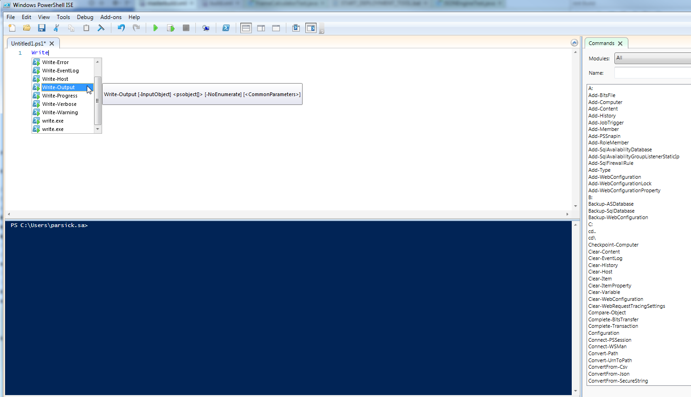

In one of my current project, I deal with how to run a Continuous Integration (CI) infrastructure on Windows machines. I have had experience in running a CI infrastructure for five years, but it was always on Linux machines. So in the next months I will write some blog posts about my challenge with Windows machines from the perspective of a Linux fan girl :-). This first blog post is about shell scripting on Windows. But bear in mind: This blog post isn't a tutorial for PowerShell scripting. It only explains striking feature coming from Linux background. When you run a CI infrastructure, it's a frequent practice to write little shell scripts to automate repeatable tasks. On a Linux system you would write your scripts in Bash or in a script language like Perl or Phyton. I usually write my script in Bash or in Groovy. I choose Groovy, because I'm a Java Developer and it is possible writing Groovy script in Java-style in the beginning and the second argument for me was, that the administration of Jenkins is easier with Groovy scripts. Jenkins supports a Groovy console for administration tasks and build job's step also can be automated with Groovy in Jenkins, directly. So I use Groovy for other automated tasks to not use so many script languages at the same time. Now you can say, ok, what's the problem. It is able to use Groovy on Windows system. The problem is the requirements in my project. It is only allowed to use Java, C# or PowerShell as programming language. But I want to write little scripts, so from this point of view, only PowerShell remains.

Switch from Bash to PowerShell - What is striking
-------------------------------------------------

Good news at first, working with PowerShell isn't as creepy as working with DOS shell. But it's different compared to Bash shell. In next section, I will report what I notice when I start writing Powershell scripts with a Bash shell background. First at all, it helps all lot for writing script in PowerShell from the Linux's point of view when you understand the difference between how Linux and Windows handle their configuration. In Linux, you only have to adjust some text files to change system's configuration. Here, the configuration is text driven and shells in Linux are optimized to handle text. On the other hand in Windows, you use an API to adjust properties in objects to change system's configuration. Here, the configuration is API driven. The next important point is that Microsoft provides a large class library, the .NET framework, that has object model of Windows' system configuration. PowerShell reuses this object model as the base for type system. So scripting in PowerShell feels more like object-oriented programming. Fortunately, we can reuse all functionality of the .NET framework in our PowerShell scripts. So if you're familiar with C# programming, the start with PowerShell scripting is very easy for you. So writing scripts for PowerShell feels like working with an OOP language. So let's look at some code sample for typical situations to see the difference between scripting for Bash and for PowerShell.

### Writing Something to the Standard Output Stream

On the Bash side, you have the built-in command `echo` for that:

```bash
echo "Hello World"
```
For PowerShell, you have a so-called Cmdlet `Write-Output`:
```powershell
Write-Output "Hello World"
```
Now, we want to write the value of a variable to standard output.

#### Bash

```bash
message="Hello World" echo $message
```

#### PowerShell

```powershell
$message="Hello World" Write-Output $message
```
That was easy, wasn't it.

### Parsing Files for a Pattern

In our example, we want to parse only XML files after a specific pattern (in our case "search-pattern") and count how often this pattern is match in all. On the Bash side, we use for Linux typically pipeline pattern. First, we use `grep` for searching the pattern and then we pipe the result of `grep` to `wc` to count the matches.

```bash
grep -w *.xml -e "search-pattern" | wc -l
```
On PowerShell, it looks little bit different. First, we have to list all XML files with `dir.` This result is piped to the Cmdlet `ForEach-Object.` This Cmdlet gets a script block. In our case, the script block reads the content of a file and pipe it to `Select-String` Cmdlet. This is responsible for filtering after the given pattern and this filter result is piped to `Measure-Object` that can calculate the numeric properties of object. In our case, it should only count the matches. At the end, every count has to be added together. The important thing is that the result of every Cmdlet is an object that has properties.

```powershell
$sum = 0
dir *.xml | ForEach-Object {
$sum += (Get-Content $_ | Select-String -Pattern 'search-pattern' | Measure-Object).Count
}
Write-Output $sum
```

### Conditions

Conditions in Bash and in PowerShell look very similar . The only difference in my opinion is the using of bracket. In PowerShell, conditions look more like in C#.

#### Bash

```bash
if [ true -a true -o false -a 2 -gt 1 -a 1 -eq 1 -a 1 -lt 3 -a !false ];
then
  # do something if the condition is true
else
  # do something if the condition is false
fi
```

#### PowerShell

```powershell
if ( 1 -and ( 1 -or 0) -and (2 -gt 1) -and ( 1 -eq 1) -and (1 -lt 3) -and (-not 0)) {
  # do something if the condition is true
} else {
  # do something if the condition is false
}
```

### Setting System Environment Variable

In both systems, Linux and Window, it is possible to set system environment variable on different context, system-wide, process or user based.

#### Bash

Setting system environment variable with Bash works like the following line:

```bash
export BASH_EXAMPLE="some value"
```
This variable is active during the current process. If you want that the variable is active system-wide, you have to edit the file `/etc/profile` or you create executable shell scripts in the directory `/etc/profile.d.` If the variable should be active only for special user session, you have to edit the file `~/.bash_profile .` You can do this programmatically with `sed` or `awk.` Using the variable works like that

```bash
echo "$BASH_EXAMPLE"
```

#### PowerShell

In the PowerShell, you can call the .NET Framework API for setting the system environment variable.

```powershell
[Environment]::SetEnvironmentVariable("WindowsExample", "Some value.", "Machine")
```
If the variable should be active only for special user or process, write `User` or `Process` instead of `Machine.` For process level there also exists another command:

```powershell
$env:WindowsExample = "Some value."
```
The .Net Framework has a `GetEnviromentVariable` method for calling the variable.

```powershell
[Environment]::GetEnvironmentVariable("WindowsExample", "Machine")
$Env:WindowsExample // shortcut
```

 When setting system environment variable, you can see the big different between the both approach for configuration, text-driven (Linux) and API-driven (Windows).

Tool Support
------------

I was pleasantly surprised when I figured out, that a PowerShell "IDE" exists, called _PowerShell Integrated Scripting Environment (ISE)_. It supports you with code completion and has a complete documentation about the Cmdlets. 

PowerShell Integration in Jenkins
---------------------------------

One use case for writing scripts is running them in a build job in Jenkins. Jenkins can't run PowerShell scripts out of the box. Fortunately, it exists a Jenkins Plugin for that called _PowerShell Plugin_. After installing this plugin a build step _Windows PowerShell_ is avaible in the job configuration. This step has a `command field` where you can add your script code directly, or you add the path to your script (see below example). In the second variant it is important to add exit `$LASTEXITCODE` otherwise the build doesn't recognize that the PowerShell script failed.

```powershell
my-first-script.ps1 exit $LASTEXITCODE
```

Further Information
-------------------

1.  Manning's book [PowerShell in Action](https://www.manning.com/books/windows-powershell-in-action)
2.  Jenkins' [PowerShell Plugi](https://wiki.jenkins-ci.org/display/JENKINS/PowerShell+Plugin)n
3.  Microsoft [TechNet about System Environment Variable](https://technet.microsoft.com/en-us/library/ff730964.aspx).
4.  nixCraft's blog post [Linux: Set Environment Variable](http://www.cyberciti.biz/faq/set-environment-variable-linux/)
