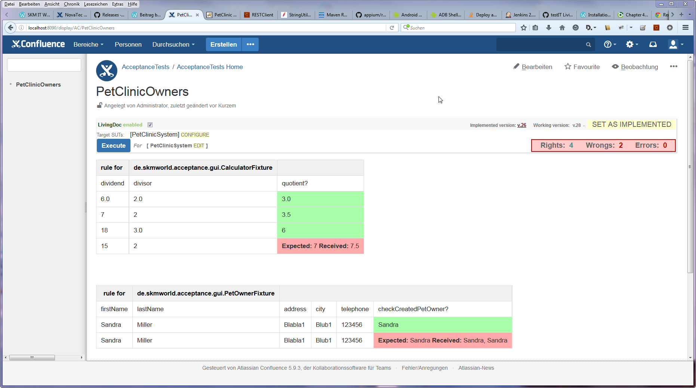

_Guest Contribution by Markus Jenderek_

We wanted to evaluate the new Confluence plugin LivingDoc as a replacement to Fitnesse in order to execute automated web GUI tests.

*   Confluence 5.7.1 (Non-Cloud version)
*   Inside Confluence HSQL In-Memory DB for evaluation purpose
*   LivingDoc plugin 1.0.0.jar
*   Selenium Webdriver for automated Web Testing of
*   Spring Petclinic running inside a Tomcat 8
*   Java Version SDK 1.7.0.80
*   Maven 3.3.1

The following steps are an extension to the LivingDoc documentation. This documentation is very detailed, but if you struggle around some steps, check the following out. We recommend to use the search function of your browser to find the relevant parts. Additional this is not about Best Practices, but only about getting the setup running fast. Let´s start:

1.  Starting point is the LivingDoc Documentation under [https://testit-livingdoc.atlassian.net/wiki](https://testit-livingdoc.atlassian.net/wiki) `> Current Documentation > Getting Started`
2.  After following this steps, go to `Current Documentation > Confluence plugin`
3.  Unfortunately, there is no direct link to the current `livingdoc-confluence5-plugin.jar`, so go to [https://github.com/testIT-LivingDoc/livingdoc-confluence/releases](https://github.com/testIT-LivingDoc/livingdoc-confluence/releases) and choose `livingdoc-confluence5-plugin-1.0.0.jar` (even there is already a version `livingdoc-confluence5-plugin-1.1.0.jar`) and download it.
4.  Next is the configuration of the Runner. Please look at the following pic:  We replaced the classpath default value with the path, where you have downloaded the `livingdoc-confluence5-plugin-1.0.0.jar` on your machine.
5.  Next is Project Management:  There, we choose our above prepared runner. Under classpaths, we copy the path to the jar of our Selenium project inclusive its dependencies. In step 7 below, it will described how this jar is built. This is needed so that the Selenium tests can be executed by LivingDoc.
6.  Next is remote agent: In order to get our scenario running, we got advice from the LivingDoc Developer Team to start a remote agent. You will get the complete remote agent jar under [https://github.com/testIT-LivingDoc/livingdoc-core/releases](https://github.com/testIT-LivingDoc/livingdoc-core/releases) . At that time, we chose `livingdoc-remote-agent-1.0.0-complete.jar` and downloaded it. Please start it like it is written  in the Livingdoc documentation (Current Documentation > Confluence Plugin > Advanced > [Remote Agent](https://testit-livingdoc.atlassian.net/wiki/display/CURDOC/Confluence+plugin#Confluenceplugin-RemoteAgent)).
7.  In order that the Selenium tests are executed by LivingDoc, we need a jar file with all our tests inclusive their dependencies. Therefore, we use Maven Assembly Plugin to build a jar with all dependencies. Below the configuration of the Maven Assembly Plugin ([Link to whole POM](https://gist.github.com/sparsick/489232b8c60c4dedfab3#file-pom-livingdoc-selenium-xml))


```xml
<plugin>
	<groupId>org.apache.maven.plugins</groupId>
	<artifactId>maven-jar-plugin</artifactId>
	<executions>
		<execution>
			<goals>
				<goal>test-jar</goal>
			</goals>
		</execution>
	</executions>
</plugin>
<plugin>
	<artifactId>maven-assembly-plugin</artifactId>
	<executions>
		<execution>
			<id>jar-with-dep</id>
			<goals>
				<goal>single</goal>
			</goals>
			<phase>package</phase>
			<configuration>
				<descriptors>
					<descriptor>src/assembly/src.xml</descriptor>
				</descriptors>
				<descriptorRefs>
					<descriptorRef>jar-with-dependencies</descriptorRef>
				</descriptorRefs>
			</configuration>
		</execution>
	</executions>
</plugin>
```
Summary
=======

Bringing all together and let the Remote Agent running, we can execute from Confluence our Selenium Test. Now we are ready to rumble. In the meantime, there is a VirtualBox image with everything inside under `[LiviningDoc documentation > Showcases](https://testit-livingdoc.atlassian.net/wiki/display/SHOW/NovaTec+LivingDoc+Showcase)`. Furthermore, there is a new release 1.1 that supports Confluence 5.9.3. But if you want to install all by yourself, we hope this can save you some time.





Links
=====

1.  [Spring Pet Clinic Project](https://github.com/spring-projects/spring-petclinic)
2.  LivingDoc on [GitHub](https://github.com/testIT-LivingDoc)
3.  LivingDoc [documentation](https://testit-livingdoc.atlassian.net/wiki)
