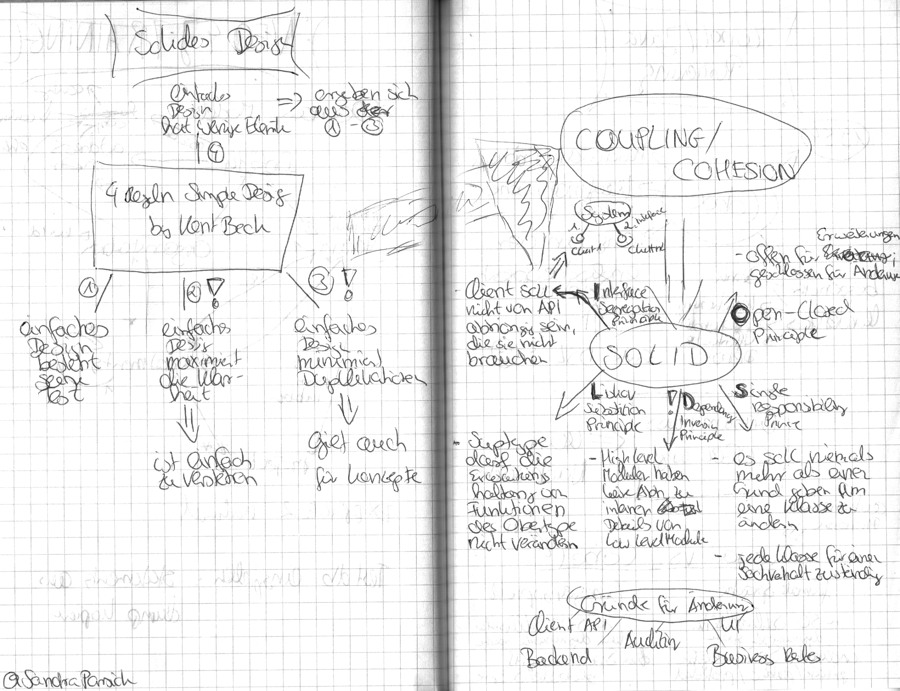

In September I visited the conference "Herbstcampus" in Nuremberg. I took notes about some sessions, that I like to share with you. The notes are in German.

### SOLIDes Design - Kriterien für objektorientiertes Design by David Tanzer

### Wie geht's? Was geht? Wann hat es Sinn? - Portierung von COBOL-Programmen nach Java by Carsten Siedentop

### Überzogen - Technische Schulden by Gerrit Beine

### Follow the Leader - Wie Sie Ihr Team beeinflussen und gestalten können by Sabine Zehnder

### So sieht's aus! -Architekturüberblicke: Tipps und Tricks by Stefan Zörner

