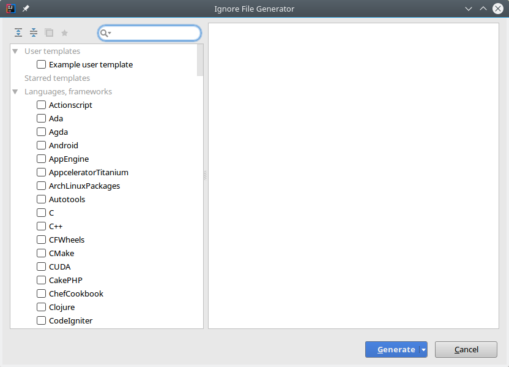

When I start a new Git repository, I lose a lot of time to set up my `.gitignore` file and normally, I don't match everything on the first shoot. Fortunately, there exists some tools, that help to bootstrapping it. I'd like to show two of them. One is a website that can be used on the command line and the another is a plugin for the IDE _IntelliJ IDEA_.

Website gitignore.io
--------------------


There is a website http://gitignore.io that lists the common ignore pattern for you specific programming language, tool, IDE etc. The usage is very simple: Fill the search with names of  tools, framework, programming language etc, which you want to use in your Git project, and the website generates the content for your `.gitignore` file. You can also run gitignore.io from your command line. Therefore, you need an active internet connection and an environment function. I'll demonstrate the integration of gitignore.io in zsh. For the integration in other shells or clients, please look into the [documentation](https://www.gitignore.io/docs#-install-command-line). Firstly, we have to create a function `gi` in our `~/.zshrc:`

```bash
echo "function gi() { curl -L -s https://www.gitignore.io/api/\$@ ;}" >> ~/.zshrc && source ~/.zshrc
```
Now, we can use it on the command line.

```bash
$ gi java,maven # Preview of the content for .gitignore

# Created by https://www.gitignore.io/api/java,maven

### Java ###
# Compiled class file
*.class

# Log file
*.log

# BlueJ files
*.ctxt

# Mobile Tools for Java (J2ME)
.mtj.tmp/

# Package Files #
*.jar
*.war
*.ear
*.zip
*.tar.gz
*.rar

# virtual machine crash logs, see http://www.java.com/en/download/help/error_hotspot.xml
hs_err_pid*

### Maven ###
target/
pom.xml.tag
pom.xml.releaseBackup
pom.xml.versionsBackup
pom.xml.next
release.properties
dependency-reduced-pom.xml
buildNumber.properties
.mvn/timing.properties

# Avoid ignoring Maven wrapper jar file (.jar files are usually ignored)
!/.mvn/wrapper/maven-wrapper.jar

# End of https://www.gitignore.io/api/java,maven

$ gi list # list currently available templates
1c-bitrix,a-frame,actionscript,ada,adobe
advancedinstaller,agda,alteraquartusii,altium,android
androidstudio,angular,anjuta,ansible,apachecordova
apachehadoop,appbuilder,appceleratortitanium,appcode,appcode+all
appcode+iml,appengine,aptanastudio,arcanist,archive
archives,archlinuxpackages,aspnetcore,assembler,atmelstudio
ats,audio,automationstudio,autotools,backup
basercms,basic,batch,bazaar,bazel
bitrix,bittorrent,blackbox,bluej,bower
bricxcc,buck,c,c++,cake
.... furthermore

$ gi java,maven >> .gitignore # append the content in your project's .gitignore
```

IntelliJ IDEA Plugin - .ignore
------------------------------

There is a plugin for IntelliJ IDEA that helps creating `.gitignore` file with content for your selected tool, programming language etc. . At first you have to install the plugin `.ignore` (Go to `File -> Settings -> Plugins` and search for `.ignore`).



You can now create `.gitignore` file via the `.ignore` plugin. By the way, the plugin can also create ignore files for other tools like Docker or Mercurial. Then a file generator is opened and you can choose templates of tools, programming language etc that you will use in the Git project.A preview shows you the possible content. A click on `Generate `and you are ready. Do you have other tips and tricks to boost the initialization time of a Git project? Share them and write a comment below.

Links
-----

1.  [gitignore.io](https://www.gitignore.io/)
2.  [Website of .ignore](http://ignore.hsz.mobi/)
