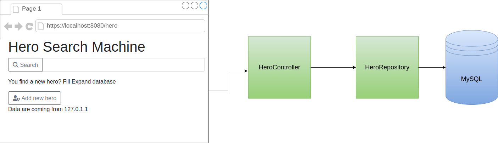

In this blog post I'd like to demonstrate how I integrate Testcontainers in Spring Boot tests for running UI tests with Selenium. 
The sample project can be found on [GitHub](https://github.com/sparsick/testcontainers-spring-boot).


Why Testcontainers?
-------------------

Testcontainers is a library that helps to integrate infrastructure components like Selenium in integration tests based on Docker Container. 
It helps to avoid writing integrated tests. 
These are kind of tests that will pass or fail based on the correctness of another system. 
In my case, Selenium. 
With Testcontainers I have the control over this dependent system. 

If you want to learn how to write integration tests with database integration, please have a look on my blog post about [Using Testcontainers in Spring Boot Tests For Database Integration Tests](https://blog.sandra-parsick.de/2020/05/21/using-testcontainers-in-spring-boot-tests-for-database-integration-tests/)


Introducing the Subject Under Test
---------------------------------

The sample project is a simple web application with an UI, based on Thymeleaf, Spring Boot and MySQL database. 




Preparing a Test with the Whole Spring Boot Web Application
----------------------

We want to test the whole application including database. 
Therefore, we need a JUnit5 test that load the complete Spring Boot context and a MySQL database.

The first step is to set up the dependencies to the test libraries.
In this case, JUnit5, Testcontainers and Spring Boot's test helper classes. 
As build tool, we use Maven. 
All test libraries provide so called [BOM "bill of material"](https://maven.apache.org/guides/introduction/introduction-to-dependency-mechanism.html#Importing_Dependencies), that helps to avoid a version mismatch in our used dependencies. 
As database, we use MySQL. 
Therefore, we use the Testcontainers' module `mysql` additional to the core module `testcontainers`. 
It provides a predefined MySQL container. 
For simplifying the container setup specifically in JUnit5 test code, Testcontainers provides a JUnit5 module `junit-jupiter`.
For Spring Boot's test helper class, we need the test dependency `spring-boot-starter-test`.

```xml
    <dependencies>
        <dependency>
            <groupId>org.junit.jupiter</groupId>
            <artifactId>junit-jupiter</artifactId>
            <scope>test</scope>
        </dependency>
        <dependency>
            <groupId>org.testcontainers</groupId>
            <artifactId>testcontainers</artifactId>
            <scope>test</scope>
        </dependency>
        <dependency>
            <groupId>org.testcontainers</groupId>
            <artifactId>junit-jupiter</artifactId>
            <scope>test</scope>
        </dependency>
        <dependency>
            <groupId>org.testcontainers</groupId>
            <artifactId>mysql</artifactId>
            <scope>test</scope>
        </dependency>
        <dependency>
          <groupId>org.springframework.boot</groupId>
          <artifactId>spring-boot-starter-test</artifactId>
          <scope>test</scope>
        </dependency>
    </dependencies>
    <dependencyManagement>
        <dependencies>
            <dependency>
                <groupId>org.junit</groupId>
                <artifactId>junit-bom</artifactId>
                <version>${junit.jupiter.version}</version>
                <type>pom</type>
                <scope>import</scope>
            </dependency>
            <dependency>
                <groupId>org.testcontainers</groupId>
                <artifactId>testcontainers-bom</artifactId>
                <version>${testcontainers.version}</version>
                <type>pom</type>
                <scope>import</scope>
            </dependency>
            <dependency>
                <groupId>org.springframework.boot</groupId>
                <artifactId>spring-boot-dependencies</artifactId>
                <version>${spring-boot.version}</version>
                <type>pom</type>
                <scope>import</scope>
            </dependency>
        </dependencies>
    </dependencyManagement>
```

Now, everything is prepared for setup the test.

```java
package com.github.sparsick.testcontainerspringboot.hero.universum;


import ...

@SpringBootTest
@Testcontainers
class HeroStartPageIT {
    @Container
    private static MySQLContainer database = new MySQLContainer("mysql:5.7.34");

    @Test
    void contextLoad() {
      
    }

    @DynamicPropertySource
    static void databaseProperties(DynamicPropertyRegistry registry) {
        registry.add("spring.datasource.url",database::getJdbcUrl);
        registry.add("spring.datasource.username", database::getUsername);
        registry.add("spring.datasource.password", database::getPassword);
    }


}

``` 

The test class is annotated with some annotations. 
The first one is `@SpringBootTest` thereby the Spring application context is started during the test. 
The last one is `@Testcontainers` . 
It is a JUnit5 extension provided by Testcontainers that manage starting and stopping the docker container during the test. 
It checks if Docker is installed on the machine, starts and stops the container during the test. 
But how Testcontainers knows which container it should start? Here, the annotation `@Container` helps. 
It marks container that should manage by the Testcontainers extension. 
In this case, a `MySQLContainer` provided by Testcontainers module `mysql`. 
This class provides a MySQL Docker container and handles such things like setting up database user, recognizing when the database is ready to use etc. 
As soon as the database is ready to use, the database schema has to be set up.
`MySQLContainer` database is static, because the container has to start before the application context starts, so that we have a change to pass the database connection configuration to the application context. 
For this, static method `databaseProperties` is responsible. 
Here, it is important that this method is annotated by `@DynamicPropertySource`. 
It overrides the application context configuration during the start phase. 
Here, we want to override the database connection configuration with the database information that we get from database container object managed by Testcontainers. 
The last step is to set up the database schema in the database. Here JPA can help. It can create a database schema automatically. we have to configure it with

```properties
# src/test/resources/application.properties
spring.jpa.hibernate.ddl-auto=update
```

Now, the whole application including a database is started if the test runs. 
This test set up is similar to the test set up, I showed in my previous blog post about [Using Testcontainers in Spring Boot Tests For Database Integration Tests](https://blog.sandra-parsick.de/2020/05/21/using-testcontainers-in-spring-boot-tests-for-database-integration-tests/#testing-the-whole-web-application-including-database)


In the next section, I will demonstrate how to add Selenium for the UI testing.

Add Selenium to the Test
----------------------

First at all, we have to add new dependencies into the project POM.

```xml
<dependencies>
    <dependency>
        <groupId>org.testcontainers</groupId>
        <artifactId>selenium</artifactId>
        <scope>test</scope>
    </dependency>
    <dependency>
        <groupId>org.seleniumhq.selenium</groupId>
        <artifactId>selenium-java</artifactId>
        <version>${selenium.version}</version>
        <scope>test</scope>
    </dependency>
    <dependency>
        <groupId>org.seleniumhq.selenium</groupId>
        <artifactId>selenium-remote-driver</artifactId>
        <version>${selenium.version}</version>
        <scope>test</scope>
    </dependency>
    <dependency>
        <groupId>org.seleniumhq.selenium</groupId>
        <artifactId>selenium-api</artifactId>
        <version>${selenium.version}</version>
        <scope>test</scope>
    </dependency>
</dependencies>

```

Testcontainers offers a module `selenium` with Selenium-specific containers. 
For Selenium, we need three dependencies, `selenium-java`, `selenium-remote-driver` and `selenium-api`. 
The dependency `selenium-api` is needed if you want to use Selenium version higher than 4.1.4. Otherwise, you get `java.lang.NoClassDefFoundError: org/openqa/selenium/AcceptedW3CCapabilityKeys` on runtime. 
Unfortunately, for Selenium doesn't exist a BOM.

The next step is to add Selenium to the above test.

The whole test including Selenium looks like the following one:

```java
package com.github.sparsick.testcontainerspringboot.hero.universum;

import ...

@Testcontainers
@SpringBootTest(webEnvironment = WebEnvironment.RANDOM_PORT)
class HeroStartPageIT {

    @Container
    private static final BrowserWebDriverContainer<?> seleniumContainer = new BrowserWebDriverContainer<>() // one browser for all tests
            .withAccessToHost(true);

    @Container
    private static final MySQLContainer database = new MySQLContainer("mysql:5.7.34");

    @LocalServerPort
    private int heroPort;

    private RemoteWebDriver browser;


    @BeforeEach
    void setUp(){
        Testcontainers.exposeHostPorts(heroPort);
        browser = new RemoteWebDriver(seleniumContainer.getSeleniumAddress(), new ChromeOptions());
        browser.manage().timeouts().implicitlyWait(Duration.ofSeconds(30));
    }
    @AfterEach
    void cleanUp() {
        browser.quit();
    }

    @Test
    void titleIsHeroSearchMachine(){
        browser.get("http://host.testcontainers.internal:" + heroPort + "/hero");
        WebElement title = browser.findElement(By.tagName("h1"));
        assertThat(title.getText().trim())
                .isEqualTo("Hero Search Machine");
    }

    @DynamicPropertySource
    static void databaseProperties(DynamicPropertyRegistry registry) {
        registry.add("spring.datasource.url",database::getJdbcUrl);
        registry.add("spring.datasource.username", database::getUsername);
        registry.add("spring.datasource.password", database::getPassword);
    }

}
```

Let's go through this test step by step.

As first step, we add 'BrowserWebDriverContainer' with the annotation `@Container`, so that the Selenium container is managed by Testcontainer. 
The next step is to configure the Selenium container can access to the Spring Boot application that is started on the host.
Therefore, we have to configure that the container has access to the host (`.withAccessToHost(true)`).
But this is not enough. 
We also have to expose the host port of the Spring Boot application to the Selenium container.
Testcontainer prepares a static helper method for this use case (`Testcontainers.exposeHostPorts(heroPort)`).
But how to get the host port of the Spring Boot application?
Spring Boot test module has a test utility annotation `@LocalServerPort`. 
So it is sufficient that a class property have this annotation, so that Spring Boot can register the port number to this class property.

```java
 @LocalServerPort
 private int heroPort;
```
Unfortunately, with the current test setup the Spring Boot application runs always on the host port 8080 (default port of Spring Boot applications).
So it is an integrated test and not an integration test. 
Spring Boot has an easy way to change it. 
We can configure the test to use random, but free, port when it starts the application context (`@SpringBootTest(webEnvironment = WebEnvironment.RANDOM_PORT)`). 

The last but one step is to configure the Selenium's remote web driver that we needed to navigate through the web page.

```java
browser = new RemoteWebDriver(seleniumContainer.getSeleniumAddress(), new ChromeOptions());
browser.manage().timeouts().implicitlyWait(Duration.ofSeconds(30));
```
First at all, it needs the address of the Selenium container (`seleniumContainer.getSeleniumAddress()`) and which browser it should simulate (here, a Chrome browser `new ChromeOptions()`).
Also, we configure an explicit timeout to avoid `TimeoutException`  (see also Testcontainer's [issue](https://github.com/testcontainers/testcontainers-java/issues/5833))

The last step is to write a test.
The most important part is to know how to access the web page, because Selenium is running in a container and the Spring Boot application runs on the host.
Testcontainers provides a dedicated host name `host.testcontainers.internal` for this use case.
So the Spring Boot application is reachable under `http://host.testcontainers.internal:" + heroPort + "/hero"` and we have everything together to write a test for the web page.


Conclusion and Overview
-----------------------

This blog post shows how we can write tests in Spring Boot with Testcontainers and Selenium. All code snippet can be found on [GitHub](https://github.com/sparsick/testcontainers-spring-boot). 

Do you have other ideas for writing end-to-end-tests? Please let me know and write a comment.

Further Information
-------------------

1. [Concept of BOM "bill of material"](https://maven.apache.org/guides/introduction/introduction-to-dependency-mechanism.html#Importing_Dependencies)
2. [Testcontainers](https://www.testcontainers.org/)
3. [Testcontainers - Networking and communicating with containers](https://www.testcontainers.org/features/networking/)
4. [Spring Boot - Testing With a Running Server](https://docs.spring.io/spring-boot/docs/current/reference/htmlsingle/#features.testing.spring-boot-applications.with-running-server)
5. [Full example in GitHub repository](https://github.com/sparsick/testcontainers-spring-boot)
6. [Using Testcontainers in Spring Boot Tests For Database Integration Tests](https://blog.sandra-parsick.de/2020/05/21/using-testcontainers-in-spring-boot-tests-for-database-integration-tests/)
